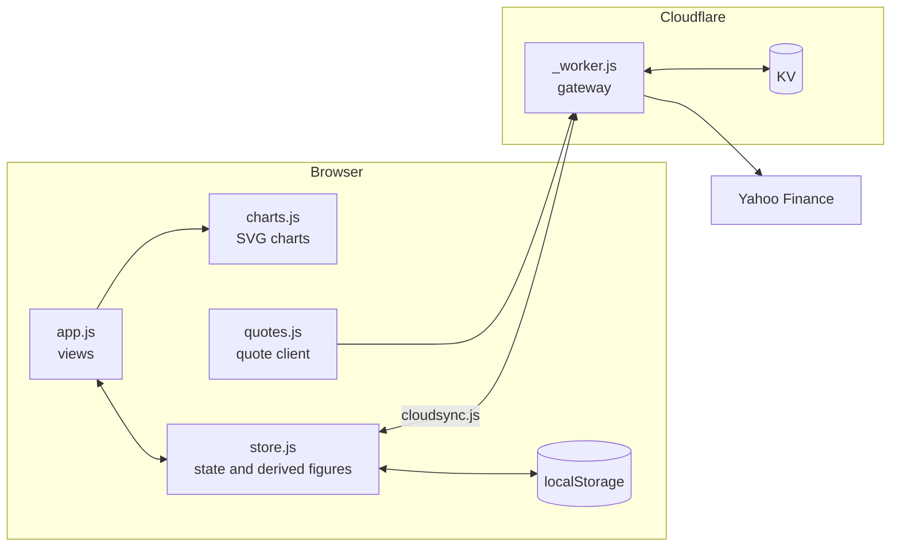

<h1 align="center">Longward</h1>

<p align="center"><b>All your wealth. One trajectory.</b></p>

<p align="center">Longward is a personal wealth dashboard that answers three questions,<br>
with numbers you can trust: <b>how much do I have, where does it sit, and where is it going?</b></p>

<p align="center">
  <a href="https://github.com/pierrelouis-fetet/Longward-demo/actions/workflows/tests.yml"></a>
  <a href="LICENSE"></a>
  
  
  
</p>

<p align="center"><a href="https://longward-demo.pages.dev"><b>Try the live demo</b></a> — fictional data, nothing to install.<br>
<a href="https://beta.longward.app"><b>Join the beta</b></a> — real accounts, your own data, sign in with your e-mail.</p>

[](https://longward-demo.pages.dev)

<p align="center">
  &nbsp;
  &nbsp;
  
</p>

## Your dashboard comes alive in four steps

Most wealth tools ask for everything before they show anything. Longward shows
something after every step, and tells you what the next one unlocks.

1. **Your accounts.** Bank accounts, savings, brokerage, life insurance, property,
   crypto, private equity. Your net worth appears the moment the first one is in.
2. **Your income.** Salary and other inflows, once. Your saving capacity follows.
3. **Your first statement.** A monthly snapshot of every pocket, prefilled with
   today's values. From the second one, your trajectory is a curve.
4. **Your fixed costs.** Rent, insurance, subscriptions, loan payments. Now the
   dashboard knows how many months you could hold if income stopped.

About four minutes for a simple situation. Stop anywhere, come back later:
nothing is lost, and the guide picks up exactly where you left it.

## What you get

| | |
|---|---|
| **Net worth** | Gross and net, every account and loan, sorted into five liquidity tiers, from cash in hand to a property that takes months to sell |
| **Allocation** | By asset class, by account type, by availability. Targets per class and a rebalancing plan that says exactly what to sell and what to buy |
| **Markets** | Live quotes for listed positions, day moves, unrealized gains, and a journal of realized sales |
| **Budget** | Income, fixed costs with their billing cycle, spending by category and month, and what is left to live on |
| **History** | One statement a month, entered in a single dialog, feeding every curve and every month-to-month variation |
| **Projection** | Compound growth to a chosen horizon, in nominal and constant euros, with your own scenario |
| **Loans** | Monthly payment, rate and insurance declared once: remaining term, interest still to pay and capital repaid each month are all derived |
| **Two languages** | French and English, switched instantly, every string translated in the same commit that adds it |
| **Export** | Real `.xlsx` workbooks with money and dates typed as such, plus a JSON backup that restores everything |

## Numbers you can trust

A wealth dashboard has one job: showing figures that are true. Four rules hold
this codebase to it, and the test suite enforces every one of them.

- **A total equals the sum of its parts.** Every percentage, every column,
  every card that shows a total is checked against what it is made of.
- **Missing data is shown as missing, never invented.** No zero stands in for
  a value you have not entered, no chart is drawn from a figure nobody has.
- **A fact has one owner.** A loan's payment lives on the fixed cost that pays
  it; everything else reads through it. Nothing is typed twice.
- **A state is declared, not deduced.** Longward points at what looks off and
  lets you decide. It never repaints a row red on a guess.

## Yours, everywhere

- **Private by design.** Your figures live in your browser. Cross-device sync
  only exists if you deploy the worker yourself, on infrastructure you control.
  No analytics, no tracking, no third party reading your numbers.
- **Installable.** A progressive web app: add it to your phone's home screen,
  use it offline, open the same dashboard on your laptop.
- **Mobile first.** Built for a 375 px screen before anything else. No table
  wider than three columns ever reaches a phone; it becomes a tappable list.
- **Leave whenever you want.** Export to Excel or JSON at any time. Your data
  never needs Longward to stay readable.

## Get started

**Try it.** The [live demo](https://longward-demo.pages.dev) runs on fictional
data. Explore every screen, then clear it and start your own.

**Join the beta.** [beta.longward.app](https://beta.longward.app) runs real
accounts: sign in with your e-mail, receive a one-time code, and start from a
blank dashboard that is yours alone. It is a beta: things will change, so
export a backup now and then.

Nothing to install on either: Longward is a web app, and on a phone it can be
added to the home screen like a native one.

## Under the hood

**No build step, no dependencies.** Plain HTML, CSS and JavaScript, served as
static files. The code that computes your net worth is exactly the code your
browser runs, and view-source is the audit trail. Charts are hand-drawn SVG.
The app will run unchanged in a decade.

```
index.html         a single page, hash routing
assets/
  store.js         state, migrations, every derived figure
  app.js           views and interactions
  charts.js        SVG charts, drawn by hand
  quotes.js        market quotes client
  cloudsync.js     cross-device sync
_worker.js         gateway and access control (Cloudflare)
tests/             118-line harness, synthetic fixture, the suites
```



Calculation is strictly separated from rendering: `store.js` never touches the
DOM, which is what makes every figure testable without driving a browser.

**Tested on every push.** Nineteen hundred test cases, no test framework: the
whole harness is [118 lines](tests/harness.js). They run in a real Chrome on
every push, and the badge above is that result.

| | |
|---|---|
| Test cases | 1,900+, in 300+ suites |
| Lines of JavaScript published | 28,000+ |
| Runtime dependencies | 0 |
| Build steps | 0 |
| Pages | 1 |

## Where your data lives

In this browser's `localStorage`, on this machine, unless you turn on sync.
Clearing your browsing data erases the dashboard, so export a JSON backup from
time to time. Those figures are personal data about you: the moment you export
a file, you are its custodian.

## Working on the code

The rules that keep the figures true, how tests are chosen and written, and
the traps of this codebase live in [CLAUDE.md](CLAUDE.md). Read it before your
first change; it is written for whoever works on the code, human or agent.

## License

[AGPL-3.0](LICENSE).
